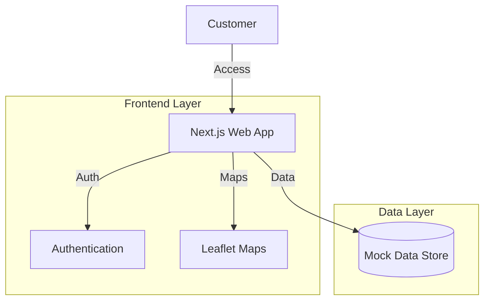
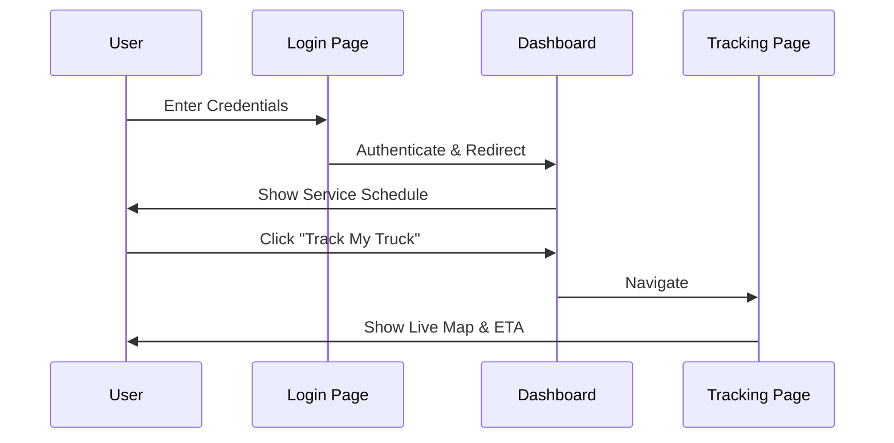

# Good Neighbor Portal 🚛♻️


The **Good Neighbor Portal** is a modern, customer-centric web application designed for West Central Sanitation. It empowers residential and commercial customers to manage their accounts, view service history, and track service trucks in real-time.

---

## 🌟 Key Features

- **🔐 Secure Authentication**: Simulated login flow with role-based access.
- **📊 Interactive Dashboard**: At-a-glance view of service schedules, billing status, and community news.
- **🚚 Live Truck Tracking**: Real-time GPS tracking of service vehicles with ETA predictions.
- **📜 Service History**: Comprehensive log of past pickups and payments.
- **👤 Profile Management**: Easy updates for contact information and preferences.
- **📱 Responsive Design**: Fully optimized for desktop, tablet, and mobile devices.

---

## 🏗️ Architecture

### System Overview


### User Journey


---

## 🚀 Getting Started

### Prerequisites
- Node.js 18+
- npm or yarn

### Installation

1. **Clone the repository**
   ```bash
   git clone https://github.com/your-username/good-neighbor-portal.git
   cd good-neighbor-portal
   ```

2. **Install dependencies**
   ```bash
   npm install
   ```

3. **Run the development server**
   ```bash
   npm run dev
   ```

4. **Open your browser**
   Navigate to [http://localhost:3000](http://localhost:3000)

---

## 🛠️ Tech Stack

- **Framework**: [Next.js 16](https://nextjs.org/) (App Router)
- **Language**: [TypeScript](https://www.typescriptlang.org/)
- **Styling**: [Tailwind CSS](https://tailwindcss.com/)
- **Icons**: [Lucide React](https://lucide.dev/)
- **Maps**: [React Leaflet](https://react-leaflet.js.org/)

---

## 📸 Screenshots

*(Placeholders for future screenshots)*

| Dashboard | Tracking |
|:---:|:---:|
|  |  |

---

## 📄 License

This project is licensed under the MIT License - see the [LICENSE](LICENSE) file for details.
