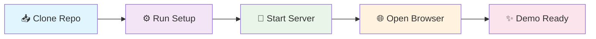
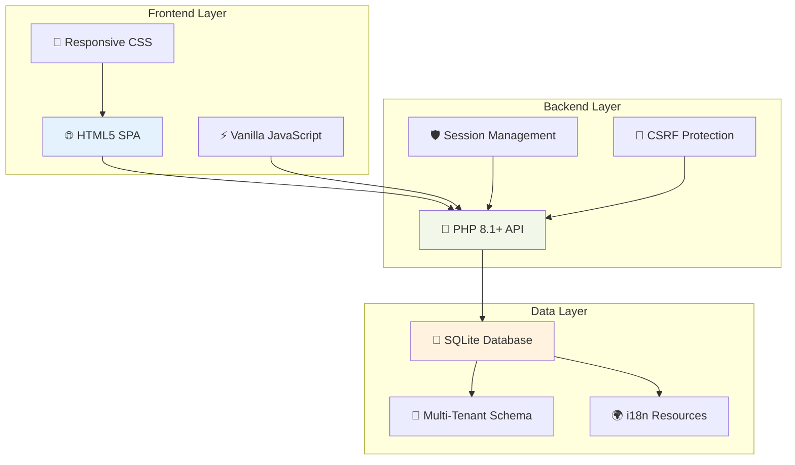
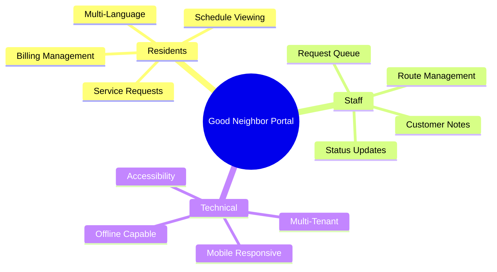
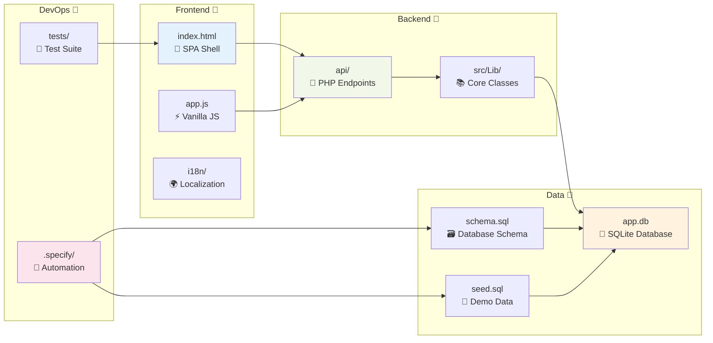

<div align="center">

# 🏘️ Good Neighbor Portal

**Professional Waste Management Customer Portal & Operations Dashboard**

[](https://php.net)
[](https://sqlite.org)
[](https://developer.mozilla.org)
[](https://web.dev/progressive-web-apps)

*A complete offline-capable demo showcasing multi-tenant support, mobile responsiveness, and bilingual interface for West Central Sanitation*

[🚀 Quick Start](#-quick-start) • [📖 Documentation](#-documentation-hub) • [🏗️ Architecture](#️-system-architecture) • [🤝 Contributing](#-contributing)

</div>

---

## 🎯 Project Overview

**Good Neighbor Portal** transforms waste management operations by providing:
- **🏠 Resident Self-Service**: Schedule pickups, submit requests, view billing
- **👥 Staff Operations**: Request triage, route management, customer notes  
- **🌍 Multi-Language**: English/Spanish with session persistence
- **📱 Mobile-First**: Responsive design with accessibility compliance
- **🔒 Demo-Ready**: Offline magic-link authentication for presentations

---

## 🚀 Quick Start

> 💡 **Pro Tip**: Use the one-command setup for instant deployment

### Prerequisites Checklist
- [ ] PHP 8.1+ installed
- [ ] Git available
- [ ] PowerShell (Windows) or Bash (macOS/Linux)
- [ ] VS Code with GitHub Copilot (recommended)

### ⚡ One-Command Setup

<details>
<summary><strong>🪟 Windows (PowerShell)</strong></summary>

```powershell
# Clone and setup in one go
git clone https://github.com/jdamhofBBW/good-neighbor-portal
cd good-neighbor-portal
.\.specify\scripts\powershell\setup.ps1

# Start development server
.\.specify\scripts\powershell\run.ps1 -Port 8080
```
</details>

<details>
<summary><strong>🐧 macOS/Linux (Bash)</strong></summary>

```bash
# Clone and setup
git clone https://github.com/jdamhofBBW/good-neighbor-portal
cd good-neighbor-portal
./.specify/scripts/bash/setup.sh

# Start development server
./.specify/scripts/bash/run.sh 8080
```
</details>

### 🎉 Access Your Portal

1. **Open**: http://127.0.0.1:8080
2. **Demo Login**: Use any email address (token shown inline)
3. **Test Features**: Run included smoke tests



---

## 🏗️ System Architecture



### Key Components

| Component | Technology | Purpose |
|-----------|------------|---------|
| 🎯 **Frontend** | Vanilla JS + HTML5 | Single-page application with hash routing |
| ⚙️ **Backend** | PHP 8.1+ | Lightweight JSON API endpoints |
| 💾 **Database** | SQLite | Multi-tenant schema with demo data |
| 🌍 **i18n** | JSON Resources | English/Spanish localization |
| 🔒 **Auth** | Magic Links | Demo-safe authentication flow |

---

## ✨ Key Features



### 🏠 Resident Features
- **📅 Service Scheduling**: View pickup schedules and service windows
- **🎫 Request Management**: Submit and track service requests
- **💳 Billing Portal**: View charges and make demo payments
- **🌍 Language Toggle**: Switch between English and Spanish

### 👥 Staff Features  
- **📋 Request Queue**: Triage and manage customer requests
- **📝 Notes System**: Add internal notes and status updates
- **📊 Route Summary**: Export CSV reports for route analysis
- **🔍 Customer Lookup**: Search and view customer details

### 🛠️ Technical Features
- **🏢 Multi-Tenant**: Neighborhood-scoped data isolation
- **📱 Mobile-First**: Responsive design with 44px+ touch targets
- **♿ Accessible**: WCAG compliance with screen reader support
- **🔒 Secure**: CSRF protection and input validation

---

## 🛠️ What's Inside



### 📁 Directory Structure

| Path | Purpose | Key Files |
|:-----|:--------|:----------|
| `/public/` | 🌐 Web root | `index.html`, `app.js`, `api/` |
| `/src/Lib/` | 📚 PHP classes | `Config.php`, `Db.php`, `Http.php`, `Util.php` |
| `/data/` | 💾 Database | `schema.sql`, `seed.sql`, `app.db` |
| `/docs/` | 📖 Documentation | Architecture, API, User guides |
| `/.specify/` | 🤖 Automation | Setup, run, test scripts |
| `/tests/` | 🧪 Test suite | Smoke tests, unit tests |

---

## 📖 Documentation Hub

<div align="center">

### 📚 Core Documentation

| Document | Purpose | Audience | Status |
|:---------|:--------|:---------|:-------|
| [🏗️ Architecture](docs/ARCHITECTURE.md) | System design & technical overview | Developers, Architects | ✅ Complete |
| [⚙️ Development](docs/DEVELOPMENT.md) | Setup, coding standards, workflows | Contributors | ✅ Complete |
| [📖 User Guide](docs/USER-GUIDE.md) | End-user instructions & tutorials | Residents, Staff | ✅ Complete |
| [🔌 API Reference](docs/API.md) | Endpoint documentation | Developers | ✅ Complete |
| [🚀 Deployment](docs/DEPLOYMENT.md) | Production deployment guide | DevOps, SysAdmins | ✅ Complete |

### 🔧 Operational Docs

| Document | Purpose | Quick Link |
|:---------|:--------|:-----------|
| [❓ Troubleshooting](docs/troubleshooting.md) | Common issues & solutions | [View →](docs/troubleshooting.md) |
| [🔗 API Endpoints](docs/endpoints.md) | Complete endpoint reference | [View →](docs/endpoints.md) |
| [🎨 UX/UI Guide](docs/ux-ui-implementation-guide.md) | Design implementation | [View →](docs/ux-ui-implementation-guide.md) |
| [📝 UX/UI Review](docs/ux-ui-review.md) | Usability recommendations | [View →](docs/ux-ui-review.md) |
| [🧭 UI Mode & Progressive Enhancement](docs/ui-guide.md) | Developer guide for UI toggle and body.enhanced | [View →](docs/ui-guide.md) |
| [♿ Accessibility Checklist](docs/accessibility.md) | WCAG 2.1 AA verification steps | [View →](docs/accessibility.md) |
| [📱 Responsive Guide](docs/responsive.md) | Breakpoints and mobile-first patterns | [View →](docs/responsive.md) |

### 📋 Spec Kit Methodology

| Document | Purpose | Status |
|:---------|:--------|:-------|
| [📜 Constitution](docs/constitution.md) | Development principles | 📋 Active |
| [📋 Specification](docs/spec.md) | Feature requirements | 📋 Active |
| [🗺️ Implementation Plan](docs/plan.md) | Development roadmap | 📋 Active |
| [✅ Task Breakdown](docs/tasks.md) | Detailed work items | 📋 Active |
| [⚖️ Decisions](docs/decisions.md) | Architecture decisions | 📋 Active |

</div>

---

### 🔼 UI Enhancements (Feature Branch)

- Spec additions: `docs/spec.md` (UI-001..UI-005)
- Plan milestone: `docs/plan.md` (Milestone 8)
- Tasks breakdown: `docs/tasks.md` (M8)
- Developer guides: `docs/ui-guide.md`, `docs/accessibility.md`, `docs/responsive.md`

Changes are being developed on `feature/ui-enhancements` to avoid impacting `main` until validated.

## 🎯 Getting Started Workflows

Choose your path based on your role:

<details>
<summary><strong>👩‍💻 I'm a Developer</strong></summary>

1. **📥 Clone & Setup**
   ```bash
   git clone https://github.com/jdamhofBBW/good-neighbor-portal
   cd good-neighbor-portal
   ./.specify/scripts/powershell/setup.ps1  # Windows
   ./.specify/scripts/bash/setup.sh         # macOS/Linux
   ```

2. **📖 Read Core Docs**
   - [🏗️ Architecture Overview](docs/ARCHITECTURE.md)
   - [⚙️ Development Guide](docs/DEVELOPMENT.md)
   - [🔌 API Reference](docs/API.md)

3. **🧪 Run Tests**
   ```powershell
   tests/smoke.ps1                    # Full workflow test
   tests/pay-deterministic.ps1        # Payment logic test
   ```

4. **🚀 Start Contributing**
   - Check [CONTRIBUTING.md](CONTRIBUTING.md)
   - Review [Spec Kit workflow](docs/constitution.md)

</details>

<details>
<summary><strong>🏢 I'm a Stakeholder/Manager</strong></summary>

1. **🎯 Understanding the Project**
   - [📊 Project Overview](#-project-overview)
   - [✨ Key Features](#-key-features)
   - [🏗️ System Architecture](#️-system-architecture)

2. **📈 Project Status**
   - [🗺️ Implementation Plan](docs/plan.md)
   - [✅ Task Progress](docs/tasks.md)
   - [📋 Recent Releases](docs/releases/)

3. **💼 Business Value**
   - Multi-tenant SaaS capabilities
   - Offline-first demonstration ready
   - Accessibility & compliance built-in

</details>

<details>
<summary><strong>👥 I'm an End User</strong></summary>

1. **🚀 Quick Demo Access**
   - Visit the deployed demo (when available)
   - Or run locally: [🚀 Quick Start](#-quick-start)

2. **📖 User Documentation**
   - [📖 User Guide](docs/USER-GUIDE.md)
   - [❓ Troubleshooting](docs/troubleshooting.md)

3. **🌍 Language Support**
   - English (default)
   - Spanish (Español)

</details>

---

## 🤝 Contributing

> 🌟 **Welcome Contributors!** We use Spec Kit methodology for systematic development

### 🚀 Quick Contribution Setup

1. **📋 Read the Guidelines**
   - [CONTRIBUTING.md](CONTRIBUTING.md) - Contribution process
   - [SECURITY.md](SECURITY.md) - Security policies
   - [docs/constitution.md](docs/constitution.md) - Development principles

2. **🔄 Spec Kit Workflow**
   ```mermaid
   graph LR
       A[📋 /constitution] --> B[🎯 /specify]
       B --> C[❓ /clarify]
       C --> D[🗺️ /plan]
       D --> E[✅ /tasks]
       E --> F[🔍 /analyze]
       F --> G[⚡ /implement]
   ```

3. **🛠️ Development Process**
   - Fork repository
   - Create feature branch: `feature/awesome-feature`
   - Follow [coding standards](docs/DEVELOPMENT.md)
   - Submit PR with comprehensive description

### 🎯 Areas for Contribution

| Area | Skills Needed | Good First Issue |
|:-----|:-------------|:-----------------|
| 🐛 **Bug Fixes** | PHP, JavaScript | [View Issues](https://github.com/jdamhofBBW/good-neighbor-portal/labels/bug) |
| 📖 **Documentation** | Technical Writing | [View Issues](https://github.com/jdamhofBBW/good-neighbor-portal/labels/documentation) |
| 🌍 **Localization** | Translation | [View Issues](https://github.com/jdamhofBBW/good-neighbor-portal/labels/i18n) |
| ♿ **Accessibility** | WCAG, ARIA | [View Issues](https://github.com/jdamhofBBW/good-neighbor-portal/labels/accessibility) |
| 🎨 **UI/UX** | CSS, Design | [View Issues](https://github.com/jdamhofBBW/good-neighbor-portal/labels/enhancement) |

---

## 📊 Project Status

<div align="center">

### 🏗️ Current Milestone: **M3 - Resident Dashboard + Billing**


</div>

| Milestone | Status | Features |
|:----------|:-------|:---------|
| ✅ **M1** | Complete | Scaffold + DB + Scripts |
| ✅ **M2** | Complete | Auth + Neighborhood Switcher |
| 🚧 **M3** | In Progress | Resident Dashboard + Billing |
| 📋 **M4** | Planned | Service Requests + Confirmations |
| 📋 **M5** | Planned | Staff Queue + Notes + Polling |
| 📋 **M6** | Planned | Route Summary + CSV Export |
| 📋 **M7** | Planned | i18n + Toggle + Tests |

### 🧪 Quality Metrics

> ⚠️ **Warning**: Ensure PHP 8.1+ is installed before setup  
> 💡 **Pro Tip**: Use the magic-link authentication for quick demo access  
> 📚 **Reference**: See [API Documentation](docs/API.md) for detailed endpoints

---

## 📝 License & Support

<div align="center">

**Good Neighbor Portal** is built with ❤️ for the waste management industry

📧 **Support**: [Create an Issue](https://github.com/jdamhofBBW/good-neighbor-portal/issues)  
🤝 **Discussions**: [GitHub Discussions](https://github.com/jdamhofBBW/good-neighbor-portal/discussions)  
📖 **Wiki**: [Project Wiki](https://github.com/jdamhofBBW/good-neighbor-portal/wiki)

---

*Last updated: 2024-12-19 | Built with [Spec Kit](https://github.com/specify-kit) methodology*

</div>

---

## 🔼 UI Enhancements (Feature Branch)

Developed on `feature/ui-enhancements` to avoid impacting `main` until validated.

What’s included:
- Progressive UI toggle with persistence (`localStorage` key `uiMode`) and i18n labels
- Enhancement styles scoped under `body.enhanced` (standard mode unchanged)
- Web audit support for enhanced mode with an npm alias
- PowerShell compatibility fix for the deterministic payment test

Try it locally:

```powershell
# Start dev server (example)
php -S 127.0.0.1:8080 -t public

# Default audit (standard mode)
npm run web-audit

# Enhanced-mode audit (cross-platform)
npm run web-audit:enhanced
```

Cross-references: see `docs/spec.md` (UI-001..UI-005), `docs/plan.md` (M8), `docs/tasks.md` (M8), and the guides in `docs/ui-guide.md`, `docs/accessibility.md`, `docs/responsive.md`.