# 🔌 API Reference Guide

> **Navigation**: [🏠 Home](../README.md) → [📖 Documentation Hub](../README.md#-documentation-hub) → API Reference

<div align="center">

**Comprehensive API Documentation**

[](.) 
[](https://swagger.io/specification/) 
[](https://www.json.org/)
[](https://restfulapi.net/)

*Last Updated: 2024-12-19 | For: Developers, API Consumers*

</div>

---

## 📋 Table of Contents

- [🌟 API Overview](#-api-overview)
- [🔐 Authentication](#-authentication)
- [📊 Data Operations](#-data-operations)
- [🎫 Service Requests](#-service-requests)
- [👥 Staff Operations](#-staff-operations)
- [🛠️ Utilities](#️-utilities)
- [📝 Response Formats](#-response-formats)
- [🚨 Error Handling](#-error-handling)
- [🔗 Related Documentation](#-related-documentation)

---

## 🌟 API Overview

```mermaid
graph LR
    subgraph "API Categories 🗂️"
        A[🔐 Authentication<br/>4 endpoints]
        B[📊 Data Operations<br/>4 endpoints]
        C[🎫 Service Requests<br/>5 endpoints]
        D[👥 Staff Operations<br/>4 endpoints]
        E[🛠️ Utilities<br/>3 endpoints]
    end
    
    subgraph "Common Features 🎯"
        F[🛡️ CSRF Protection]
        G[🏢 Multi-Tenant]
        H[🌍 i18n Support]
        I[📱 Mobile Ready]
    end
    
    A --> F
    B --> G
    C --> H
    D --> I
    E --> F
    
    style A fill:#e3f2fd
    style B fill:#f1f8e9
    style C fill:#fff3e0
    style D fill:#fce4ec
    style E fill:#e8f5e8
```



### 🎯 API Characteristics

| Feature | Implementation | Benefit |
|:--------|:---------------|:--------|
| **🔄 RESTful Design** | Standard HTTP methods & status codes | Intuitive developer experience |
| **🛡️ Security First** | CSRF tokens + input validation | Production-ready security |
| **🏢 Multi-Tenant** | Automatic tenant isolation | Scalable SaaS architecture |
| **🌍 Internationalization** | JSON response localization | Global market support |
| **📱 Mobile Optimized** | Lightweight JSON responses | Fast mobile performance |
| **🔍 Self-Documenting** | Consistent response schemas | Reduced integration time |

---

## 🔐 Authentication

### Authentication Flow Diagram


### 🎯 GET /api/csrf.php

**Purpose**: Generate CSRF token for secure form submissions

<details>
<summary><strong>📋 Request Details</strong></summary>

**Method**: `GET`  
**Authentication**: None required  
**Rate Limit**: 100 requests/minute

**Headers**:
```http
Accept: application/json
```

</details>

<details>
<summary><strong>✅ Response Format</strong></summary>

**Success (200)**:
```json
{
  "csrf": "a1b2c3d4e5f6..."
}
```

**Usage**:
```javascript
// JavaScript Example
const response = await fetch('/api/csrf.php');
const {csrf} = await response.json();
// Include in subsequent POST requests as X-CSRF header
```

</details>

### 🔐 POST /api/auth_request.php

**Purpose**: Request magic link authentication token

<details>
<summary><strong>📋 Request Details</strong></summary>

**Method**: `POST`  
**Authentication**: CSRF token required  
**Rate Limit**: 5 requests/minute per email

**Headers**:
```http
Content-Type: application/json
X-CSRF: [csrf_token]
```

**Body**:
```json
{
  "email": "resident@example.com",
  "tenant": "willmar-mn"
}
```

**Validation Rules**:
- `email`: Valid email format, max 255 chars
- `tenant`: Must exist in tenants table

</details>

<details>
<summary><strong>✅ Response Formats</strong></summary>

**Success (200)**:
```json
{
  "ok": true,
  "token": "demo_1a2b3c4d5e6f",
  "expires_in": 900
}
```

**Validation Error (400)**:
```json
{
  "ok": false,
  "error": "invalid_email",
  "message": "Please provide a valid email address"
}
```

**Rate Limited (429)**:
```json
{
  "ok": false,
  "error": "rate_limited",
  "message": "Too many requests. Try again in 60 seconds.",
  "retry_after": 60
}
```

</details>

### ✅ POST /api/auth_verify.php

**Purpose**: Verify magic link token and establish session

<details>
<summary><strong>📋 Request Details</strong></summary>

**Method**: `POST`  
**Authentication**: CSRF token required  
**Rate Limit**: 10 requests/minute per IP

**Headers**:
```http
Content-Type: application/json
X-CSRF: [csrf_token]
```

**Body**:
```json
{
  "token": "demo_1a2b3c4d5e6f",
  "tenant": "willmar-mn"
}
```

</details>

<details>
<summary><strong>✅ Response Formats</strong></summary>

**Success (200)**:
```json
{
  "ok": true,
  "user": {
    "id": 1,
    "email": "resident@example.com",
    "role": "resident",
    "tenant": "willmar-mn",
    "created_at": "2024-01-15T10:30:00Z"
  },
  "session": {
    "expires_at": "2024-01-15T18:30:00Z"
  }
}
```

**Invalid Token (401)**:
```json
{
  "ok": false,
  "error": "invalid_token",
  "message": "Token is invalid or has expired"
}
```

</details>

### 🔓 POST /api/logout.php

**Purpose**: End user session and clear authentication

<details>
<summary><strong>📋 Request Details</strong></summary>

**Method**: `POST`  
**Authentication**: Valid session required  
**Rate Limit**: None

**Headers**:
```http
Content-Type: application/json
X-CSRF: [csrf_token]
```

</details>

<details>
<summary><strong>✅ Response Format</strong></summary>

**Success (200)**:
```json
{
  "ok": true,
  "message": "Successfully logged out"
}
```

</details>

---

## 📊 Data Operations

### 📈 GET /api/dashboard.php

**Purpose**: Retrieve user dashboard with personalized data

<details>
<summary><strong>📋 Request Details</strong></summary>

**Method**: `GET`  
**Authentication**: Valid session required  
**Rate Limit**: 30 requests/minute

**Headers**:
```http
Accept: application/json
Cookie: PHPSESSID=[session_id]
```

</details>

<details>
<summary><strong>✅ Response Format</strong></summary>

**Success (200)**:
```json
{
  "ok": true,
  "dashboard": {
    "next_pickup": {
      "date": "2024-01-16",
      "service": "Regular Collection",
      "time_window": "6:00 AM - 2:00 PM"
    },
    "last_request": {
      "id": 42,
      "category": "bulk_pickup",
      "status": "in_progress",
      "created_at": "2024-01-10T14:30:00Z"
    },
    "billing": {
      "current_balance": 0,
      "last_payment": "2024-01-01T00:00:00Z",
      "next_due": "2024-02-01T00:00:00Z"
    },
    "announcements": [
      {
        "id": 1,
        "title": "Holiday Schedule",
        "message": "No collection on New Year's Day",
        "priority": "high",
        "expires_at": "2024-01-02T00:00:00Z"
      }
    ]
  }
}
```

</details>

### 📋 GET /api/recent_activity.php

**Purpose**: Get chronological activity feed for user

<details>
<summary><strong>📋 Request Details</strong></summary>

**Method**: `GET`  
**Authentication**: Valid session required  
**Rate Limit**: 20 requests/minute

**Query Parameters**:
- `limit` (optional): Number of items to return (default: 10, max: 50)
- `offset` (optional): Pagination offset (default: 0)

**Headers**:
```http
Accept: application/json
Cookie: PHPSESSID=[session_id]
```

</details>

<details>
<summary><strong>✅ Response Format</strong></summary>

**Success (200)**:
```json
{
  "ok": true,
  "activity": [
    {
      "id": "req_42",
      "type": "service_request",
      "title": "Bulk pickup request submitted",
      "description": "Large furniture items",
      "status": "in_progress",
      "created_at": "2024-01-10T14:30:00Z",
      "updated_at": "2024-01-11T09:15:00Z"
    },
    {
      "id": "bill_25",
      "type": "billing",
      "title": "Payment received",
      "description": "Monthly service fee",
      "amount": "$25.00",
      "created_at": "2024-01-01T10:00:00Z"
    }
  ],
  "pagination": {
    "total": 25,
    "limit": 10,
    "offset": 0,
    "has_more": true
  }
}
```

</details>

### 🏢 GET /api/tenants.php

**Purpose**: List available tenants and current selection

<details>
<summary><strong>📋 Request Details</strong></summary>

**Method**: `GET`  
**Authentication**: None required  
**Rate Limit**: 10 requests/minute

**Headers**:
```http
Accept: application/json
```

</details>

<details>
<summary><strong>✅ Response Format</strong></summary>

**Success (200)**:
```json
{
  "ok": true,
  "tenants": [
    {
      "slug": "willmar-mn",
      "name": "Willmar, MN",
      "timezone": "America/Chicago",
      "active": true
    },
    {
      "slug": "kandiyohi-mn", 
      "name": "Kandiyohi, MN",
      "timezone": "America/Chicago",
      "active": false
    }
  ],
  "active": "willmar-mn"
}
```

</details>

---

## 🎫 Service Requests

### Request Lifecycle Diagram


### 📝 POST /api/request_create.php

**Purpose**: Create new service request

<details>
<summary><strong>📋 Request Details</strong></summary>

**Method**: `POST`  
**Authentication**: Valid session required  
**Rate Limit**: 5 requests/hour per user

**Headers**:
```http
Content-Type: application/json
X-CSRF: [csrf_token]
Cookie: PHPSESSID=[session_id]
```

**Body**:
```json
{
  "category": "bulk_pickup",
  "description": "Large couch and dining table",
  "address_id": 15,
  "preferred_date": "2024-01-20",
  "contact_method": "email"
}
```

**Validation Rules**:
- `category`: One of `bulk_pickup`, `container_swap`, `issue_report`
- `description`: 10-500 characters
- `address_id`: Must belong to authenticated user
- `preferred_date`: Future date within 30 days (optional)
- `contact_method`: One of `email`, `phone`, `app` (optional)

</details>

<details>
<summary><strong>✅ Response Formats</strong></summary>

**Success (201)**:
```json
{
  "ok": true,
  "request": {
    "id": 43,
    "category": "bulk_pickup",
    "description": "Large couch and dining table",
    "status": "new",
    "address": "123 Main St, Willmar, MN 56201",
    "preferred_date": "2024-01-20",
    "created_at": "2024-01-15T14:30:00Z",
    "estimated_completion": "2024-01-22T00:00:00Z"
  },
  "next_steps": [
    "Staff will review your request within 24 hours",
    "You'll receive updates via your preferred contact method",
    "Track progress at any time in your dashboard"
  ]
}
```

**Validation Error (400)**:
```json
{
  "ok": false,
  "error": "validation_failed",
  "details": {
    "category": "Category is required",
    "description": "Description must be between 10 and 500 characters"
  }
}
```

**Rate Limited (429)**:
```json
{
  "ok": false,
  "error": "rate_limited",
  "message": "Maximum 5 requests per hour. Try again later.",
  "retry_after": 3600
}
```

</details>

### 👀 GET /api/request_get.php

**Purpose**: Get detailed request information

<details>
<summary><strong>📋 Request Details</strong></summary>

**Method**: `GET`  
**Authentication**: Valid session required  
**Rate Limit**: 60 requests/minute

**Query Parameters**:
- `id` (required): Request ID to retrieve

**Headers**:
```http
Accept: application/json
Cookie: PHPSESSID=[session_id]
```

</details>

<details>
<summary><strong>✅ Response Formats</strong></summary>

**Success (200)**:
```json
{
  "ok": true,
  "request": {
    "id": 43,
    "category": "bulk_pickup",
    "description": "Large couch and dining table",
    "status": "in_progress",
    "address": "123 Main St, Willmar, MN 56201",
    "preferred_date": "2024-01-20",
    "created_at": "2024-01-15T14:30:00Z",
    "updated_at": "2024-01-16T09:15:00Z",
    "estimated_completion": "2024-01-22T00:00:00Z",
    "progress": {
      "percentage": 60,
      "current_step": "Scheduled for pickup",
      "next_step": "Pickup in progress"
    }
  }
}
```

**Not Found (404)**:
```json
{
  "ok": false,
  "error": "request_not_found",
  "message": "Request not found or access denied"
}
```

</details>

---

## 👥 Staff Operations

> 🔐 **Authentication Required**: All staff operations require `X-Staff-Key` header with valid staff key

### Staff Authorization Flow


### 📋 GET /api/staff_queue.php

**Purpose**: Retrieve staff work queue with filtering

<details>
<summary><strong>📋 Request Details</strong></summary>

**Method**: `GET`  
**Authentication**: Staff key required  
**Rate Limit**: 30 requests/minute

**Headers**:
```http
Accept: application/json
X-Staff-Key: [staff_key]
Cookie: PHPSESSID=[session_id]
```

**Query Parameters**:
- `status` (optional): Filter by status (`new`, `ack`, `in_progress`, `done`, `cancelled`)
- `category` (optional): Filter by category
- `limit` (optional): Number of items (default: 20, max: 100)
- `sort` (optional): Sort order (`created_asc`, `created_desc`, `priority`)

</details>

<details>
<summary><strong>✅ Response Format</strong></summary>

**Success (200)**:
```json
{
  "ok": true,
  "queue": [
    {
      "id": 43,
      "category": "bulk_pickup",
      "status": "new",
      "description": "Large couch and dining table",
      "resident": {
        "email": "resident@example.com",
        "address": "123 Main St, Willmar, MN 56201"
      },
      "priority": "normal",
      "created_at": "2024-01-15T14:30:00Z",
      "due_date": "2024-01-22T00:00:00Z",
      "estimated_duration": "2 hours",
      "notes_count": 0
    }
  ],
  "summary": {
    "total": 15,
    "by_status": {
      "new": 3,
      "ack": 5,
      "in_progress": 4,
      "done": 3,
      "cancelled": 0
    },
    "avg_completion_time": "48 hours"
  }
}
```

</details>

### 🔄 POST /api/request_update.php

**Purpose**: Update request status (staff only)

<details>
<summary><strong>📋 Request Details</strong></summary>

**Method**: `POST`  
**Authentication**: Staff key + CSRF token required  
**Rate Limit**: 20 requests/minute

**Headers**:
```http
Content-Type: application/json
X-Staff-Key: [staff_key]
X-CSRF: [csrf_token]
Cookie: PHPSESSID=[session_id]
```

**Body**:
```json
{
  "request_id": 43,
  "status": "in_progress",
  "note": "Started pickup process, arriving on-site at 2 PM"
}
```

**Status Transitions**:
- `new` → `ack`, `cancelled`
- `ack` → `in_progress`, `cancelled`
- `in_progress` → `done`, `cancelled`

</details>

<details>
<summary><strong>✅ Response Formats</strong></summary>

**Success (200)**:
```json
{
  "ok": true,
  "request": {
    "id": 43,
    "status": "in_progress",
    "updated_at": "2024-01-16T14:00:00Z"
  },
  "message": "Request status updated successfully"
}
```

**Invalid Transition (400)**:
```json
{
  "ok": false,
  "error": "invalid_status_transition",
  "message": "Cannot change status from 'done' to 'in_progress'",
  "allowed_transitions": ["cancelled"]
}
```

</details>

---

## 🛠️ Utilities

### 🏥 GET /api/ping.php

**Purpose**: Health check endpoint

<details>
<summary><strong>📋 Request Details</strong></summary>

**Method**: `GET`  
**Authentication**: None required  
**Rate Limit**: None

**Headers**:
```http
Accept: application/json
```

</details>

<details>
<summary><strong>✅ Response Format</strong></summary>

**Success (200)**:
```json
{
  "ok": true,
  "env": "dev",
  "timestamp": "2024-01-15T14:30:00Z",
  "version": "1.3.0"
}
```

</details>

### 🔍 GET /api/diag.php

**Purpose**: System diagnostics and health status

<details>
<summary><strong>📋 Request Details</strong></summary>

**Method**: `GET`  
**Authentication**: None required  
**Rate Limit**: 10 requests/minute

**Headers**:
```http
Accept: application/json
```

</details>

<details>
<summary><strong>✅ Response Format</strong></summary>

**Success (200)**:
```json
{
  "ok": true,
  "php": {
    "version": "8.1.12",
    "extensions": ["pdo", "pdo_sqlite", "sqlite3"],
    "memory_limit": "128M",
    "upload_max_filesize": "2M"
  },
  "database": {
    "type": "SQLite",
    "version": "3.39.4",
    "file_size": "45.2 KB",
    "connection": "ok"
  },
  "filesystem": {
    "logs_writable": true,
    "data_writable": true,
    "tmp_writable": true
  }
}
```

</details>

---

## 📝 Response Formats

### Standard Response Schema

All API responses follow a consistent schema:

```typescript
interface APIResponse<T = any> {
  ok: boolean;                    // Success indicator
  data?: T;                      // Response payload (success)
  error?: string;                // Error code (failure)
  message?: string;              // Human-readable message
  timestamp?: string;            // ISO 8601 timestamp
  request_id?: string;          // Unique request identifier
}
```

### HTTP Status Codes

| Status | Meaning | Usage |
|:-------|:--------|:------|
| **200** | OK | Successful GET/POST operations |
| **201** | Created | Successful resource creation |
| **400** | Bad Request | Validation errors, malformed requests |
| **401** | Unauthorized | Authentication required |
| **403** | Forbidden | Insufficient permissions |
| **404** | Not Found | Resource doesn't exist |
| **429** | Too Many Requests | Rate limit exceeded |
| **500** | Internal Server Error | Server-side errors |

---

## 🚨 Error Handling

### Common Error Codes


### Error Response Examples

<details>
<summary><strong>🔍 Validation Error (400)</strong></summary>

```json
{
  "ok": false,
  "error": "validation_failed",
  "message": "One or more fields failed validation",
  "details": {
    "email": "Email format is invalid",
    "description": "Description must be at least 10 characters"
  },
  "timestamp": "2024-01-15T14:30:00Z",
  "request_id": "req_1234567890"
}
```

</details>

<details>
<summary><strong>🔐 Authentication Error (401)</strong></summary>

```json
{
  "ok": false,
  "error": "not_authed",
  "message": "Authentication required to access this resource",
  "timestamp": "2024-01-15T14:30:00Z",
  "help_url": "https://docs.example.com/authentication"
}
```

</details>

<details>
<summary><strong>⏰ Rate Limit Error (429)</strong></summary>

```json
{
  "ok": false,
  "error": "rate_limit_exceeded",
  "message": "Too many requests. Please try again later.",
  "retry_after": 300,
  "limit": 5,
  "window": "1 hour",
  "timestamp": "2024-01-15T14:30:00Z"
}
```

</details>

### Error Handling Best Practices

> 💡 **Tip**: Always check the `ok` field first to determine success/failure
> 
> 🔍 **Debug**: Use `request_id` for support requests and debugging
> 
> ⏰ **Retry**: Respect `retry_after` headers for rate-limited requests
> 
> 📝 **Logging**: Log error responses for troubleshooting

---

## 🔗 Related Documentation

### 📚 Internal References

| Document | Purpose | Relevance |
|:---------|:--------|:----------|
| [🏗️ Architecture Guide](ARCHITECTURE.md) | System design overview | API implementation context |
| [⚙️ Development Guide](DEVELOPMENT.md) | Setup and testing | Local API development |
| [🔗 Endpoints Reference](endpoints.md) | Complete endpoint list | Quick reference table |
| [❓ Troubleshooting](troubleshooting.md) | Common API issues | Problem resolution |

### 🛠️ Development Tools

- **📋 Postman Collection**: [Download API Collection](../tools/postman-collection.json)
- **🧪 Test Scripts**: Located in `/tests/api/`
- **📊 API Monitoring**: Available in development environment
- **🔍 Request Logging**: Check `/logs/api-requests.log`

### 🌐 External References

- [REST API Best Practices](https://restfulapi.net/rest-api-best-practices/)
- [HTTP Status Codes](https://httpstatuses.com/)
- [JSON Schema Specification](https://json-schema.org/)
- [OpenAPI 3.0 Specification](https://swagger.io/specification/)

---

<div align="center">

**🔌 API Reference Complete**

For questions or integration support, see [📖 Documentation Hub](../README.md#-documentation-hub)

*Maintained by the Good Neighbor Portal team*

</div>