# 🏗️ Technical Architecture Guide

> **Navigation**: [🏠 Home](../README.md) → [📖 Documentation Hub](../README.md#-documentation-hub) → Architecture

**System Design & Technical Overview**

 
 

*Last Updated: 2024-12-19 | For: Developers, Architects*

---

## 📋 Table of Contents

- [🎯 System Overview](#-system-overview)
- [🏗️ Architecture Layers](#️-architecture-layers)
- [🗃️ Database Design](#️-database-design)
- [🔌 API Architecture](#-api-architecture)
- [🌐 Frontend Architecture](#-frontend-architecture)
- [🔒 Security Architecture](#-security-architecture)
- [🚀 Deployment Architecture](#-deployment-architecture)
- [📊 Performance Considerations](#-performance-considerations)
- [🔗 Related Documentation](#-related-documentation)

---

## 🎯 System Overview

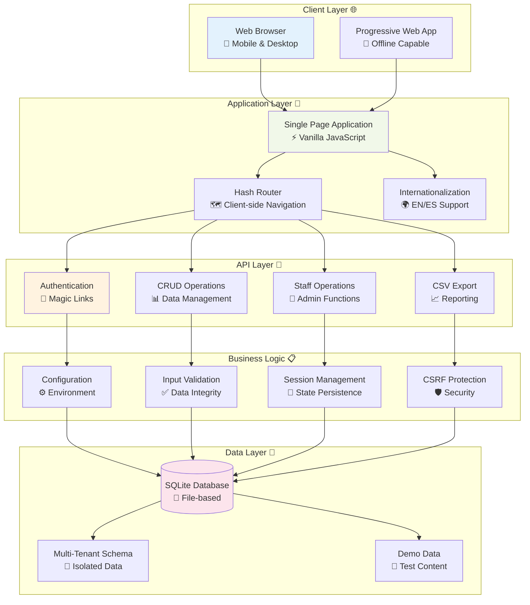

### 🎯 Design Principles

| Principle | Implementation | Benefit |
|:----------|:---------------|:--------|
| **🔄 Offline-First** | SQLite + Local Session | Reliable demo environment |
| **📱 Mobile-First** | Responsive CSS + Touch targets | Accessible on all devices |
| **🏢 Multi-Tenant** | Tenant-scoped queries | Scalable SaaS architecture |
| **🌍 Internationalization** | JSON-based translations | Global market ready |
| **🔒 Security-First** | CSRF + Input validation | Production-ready security |
| **⚡ Performance** | Vanilla JS + Minimal footprint | Fast loading times |

---

## 🏗️ Architecture Layers

### 🌐 Presentation Layer

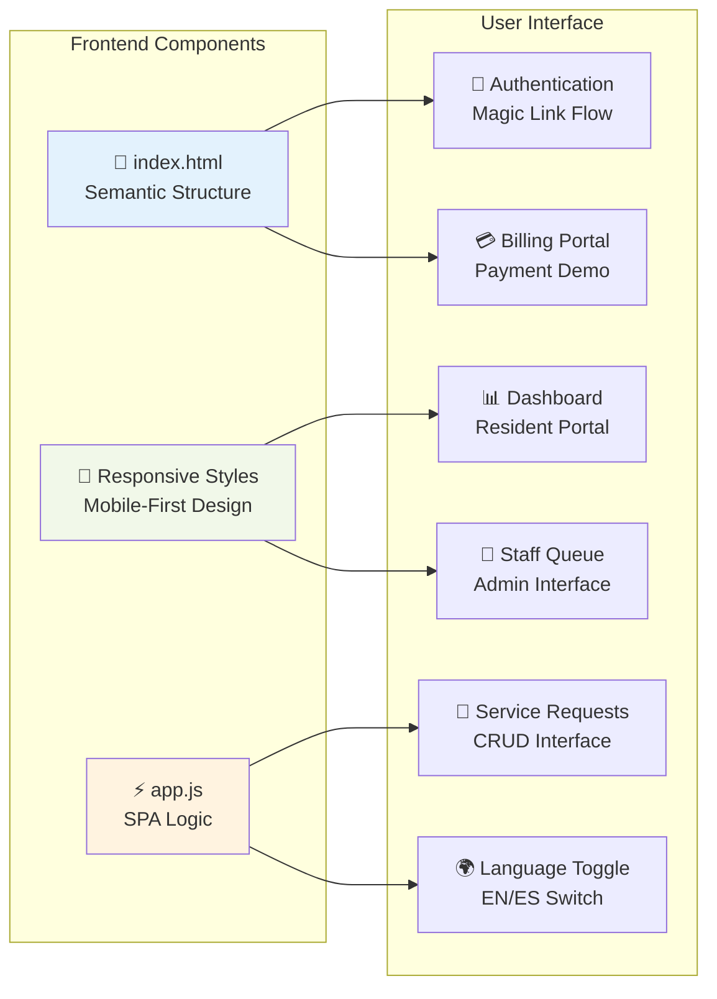

**Key Technologies:**
- **HTML5**: Semantic markup with ARIA accessibility
- **CSS3**: Flexbox/Grid layouts with responsive design
- **Vanilla JavaScript**: No framework dependencies for minimal footprint
- **Hash Router**: Client-side navigation for SPA behavior

### 🔧 Application Layer

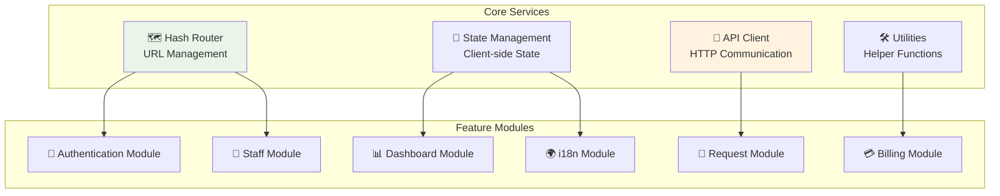

**Design Patterns:**
- **Module Pattern**: Isolated feature modules
- **Observer Pattern**: Event-driven state updates
- **Strategy Pattern**: Pluggable validation rules
- **Factory Pattern**: Dynamic component creation

### 🔌 Backend Layer

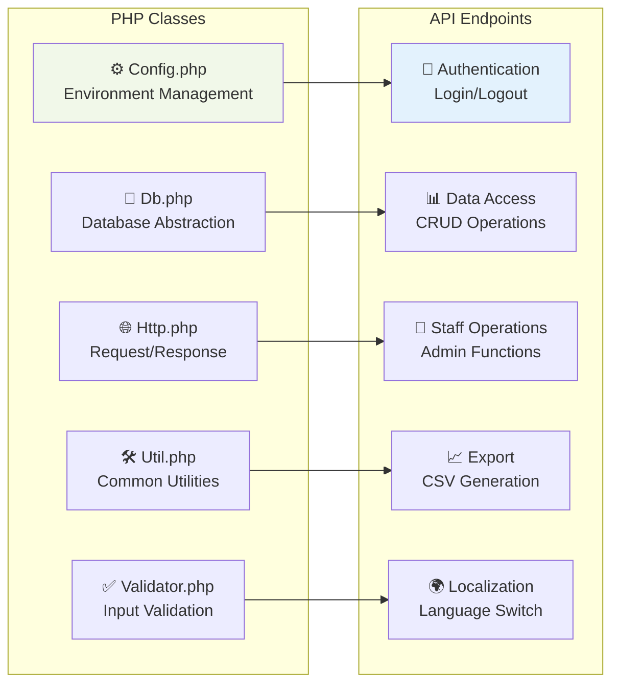

---

## 🗃️ Database Design

### 📊 Entity Relationship Diagram

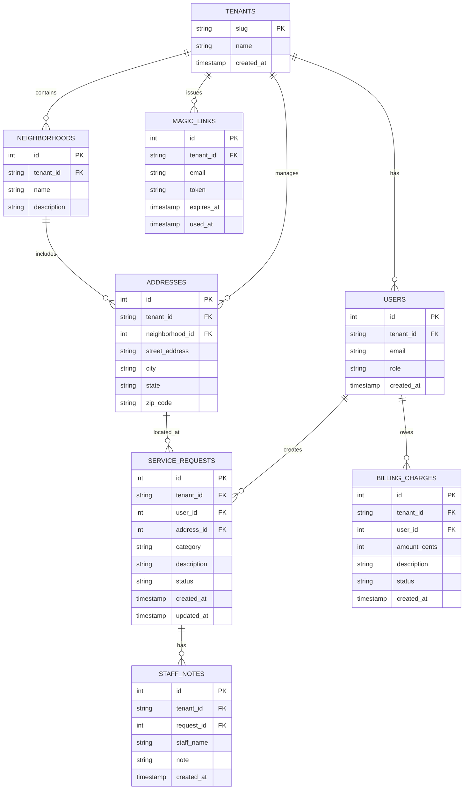

### 🏢 Multi-Tenancy Strategy

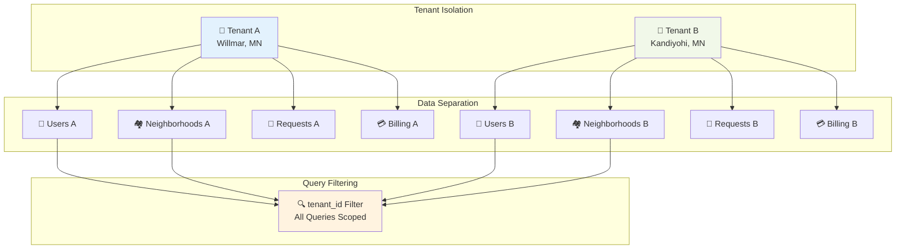

**Implementation Details:**
- **Row-Level Security**: Every query includes `tenant_id` filter
- **Data Isolation**: Complete separation between tenants
- **Demo Safety**: Tenant switching in UI for demonstration
- **Scalability**: Ready for production multi-tenancy

---

## 🔌 API Architecture

### 🌐 RESTful Endpoints

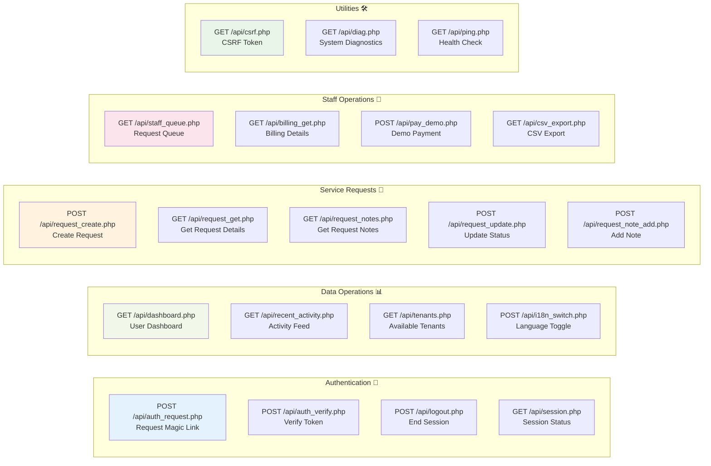

### 🔒 Security Layer

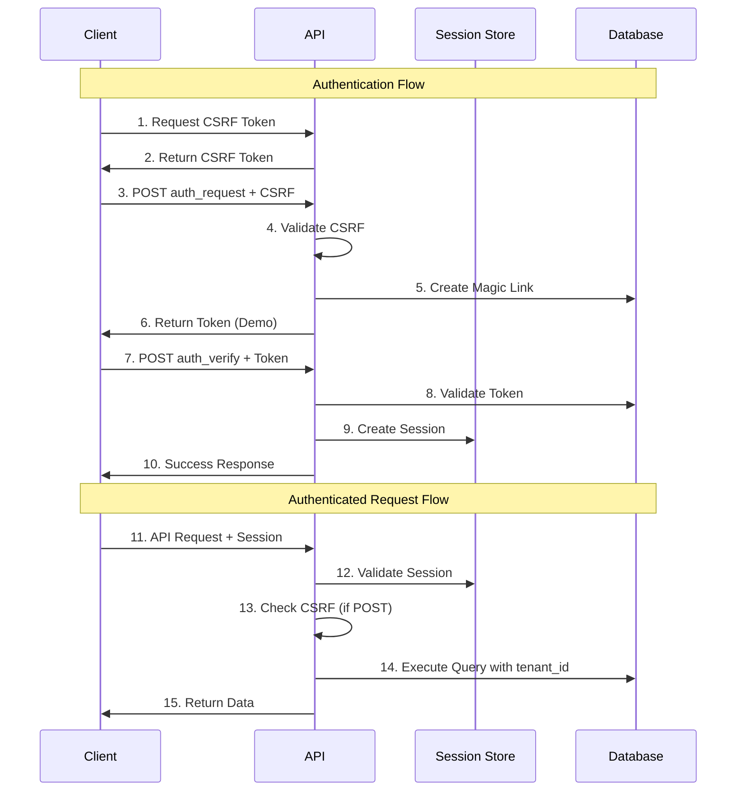

**Security Measures:**
- **🛡️ CSRF Protection**: Required for all state-changing operations
- **🔐 Session Management**: PHP sessions with fallback headers
- **✅ Input Validation**: Server-side validation for all inputs
- **🏢 Tenant Isolation**: Automatic tenant_id filtering
- **⏰ Magic Link Expiry**: Time-limited authentication tokens

---

## 🌐 Frontend Architecture

### ⚡ Single Page Application Flow

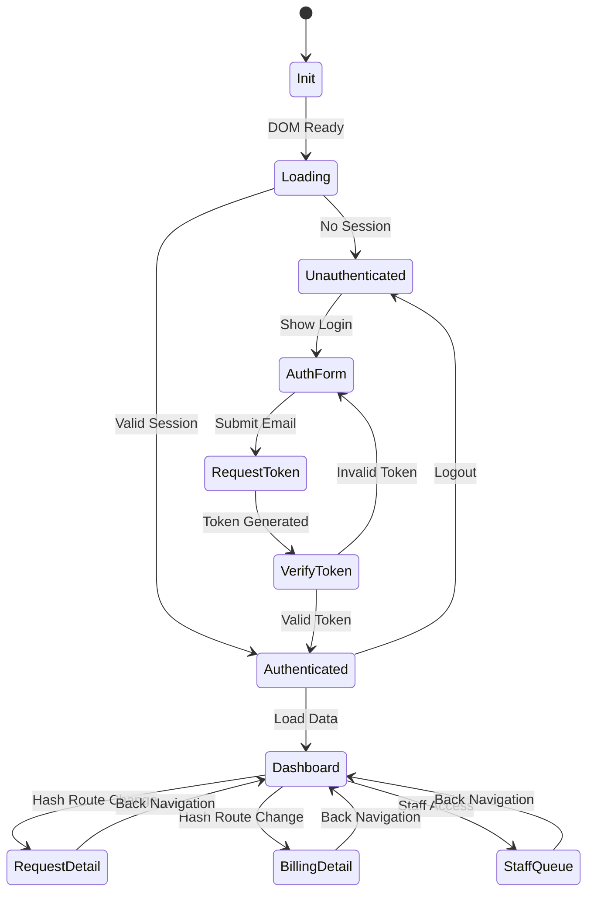

### 🎨 Component Architecture

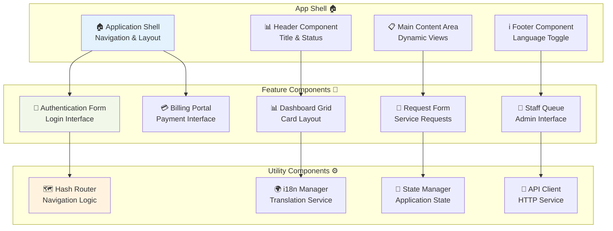

---

## 🚀 Deployment Architecture

### 🌐 Development Environment

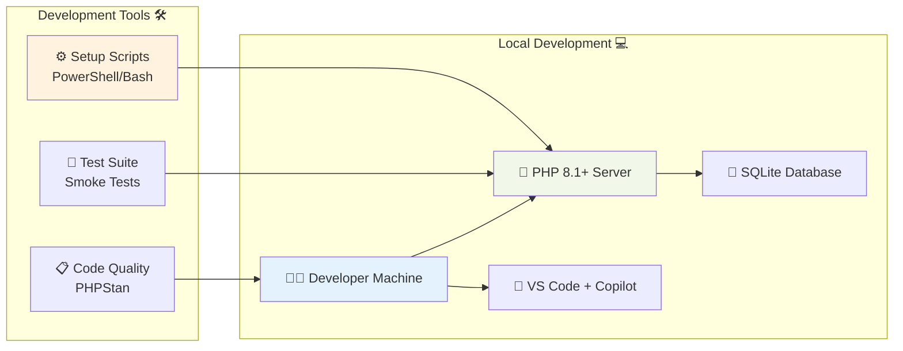

### 🏗️ Production Ready Architecture

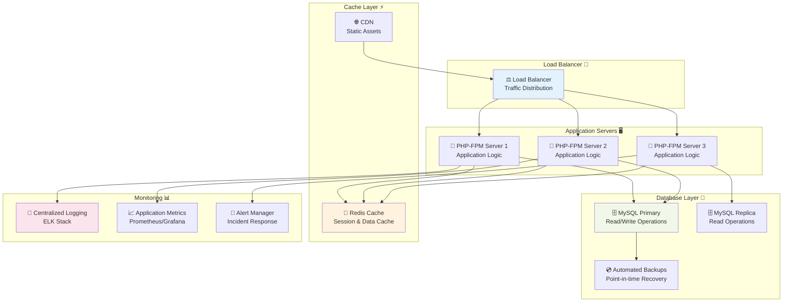

---

## 📊 Performance Considerations

### ⚡ Frontend Performance

| Optimization | Implementation | Impact |
|:-------------|:---------------|:-------|
| **🗜️ Minimal Bundle** | Vanilla JS, no frameworks | < 50KB total |
| **🔄 Lazy Loading** | Hash-based route splitting | Faster initial load |
| **📱 Mobile First** | Responsive design patterns | Better mobile performance |
| **♿ Accessibility** | Semantic HTML + ARIA | Improved screen reader performance |
| **⚡ Critical CSS** | Inline essential styles | Reduced render blocking |

### 🔧 Backend Performance

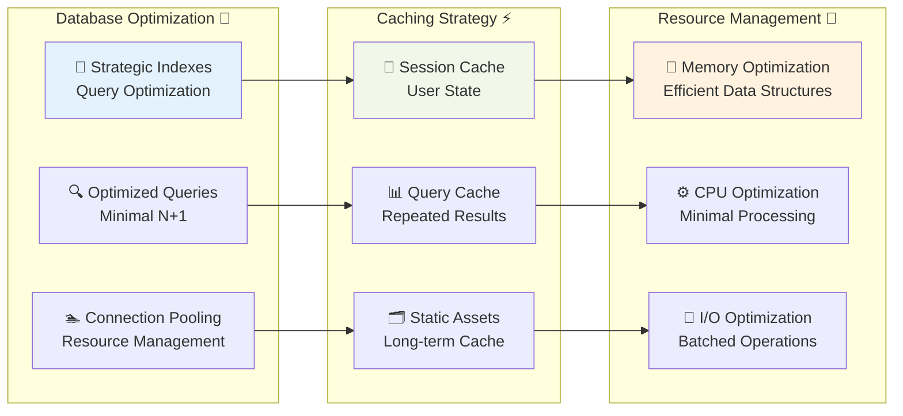

### 📈 Scalability Metrics

> 📊 **Performance Targets**
> - **⚡ Page Load**: < 2 seconds on 3G
> - **🔄 API Response**: < 500ms average
> - **📱 Mobile Performance**: > 90 Lighthouse score
> - **♿ Accessibility**: WCAG 2.1 AA compliance
> - **🌍 Multi-language**: < 100ms language switch

---

## 🔗 Related Documentation

### 📚 Internal References

| Document | Purpose | Relevance |
|:---------|:--------|:----------|
| [⚙️ Development Guide](DEVELOPMENT.md) | Setup and coding standards | Implementation details |
| [🔌 API Reference](API.md) | Endpoint documentation | API specifications |
| [📖 User Guide](USER-GUIDE.md) | End-user instructions | User workflows |
| [🚀 Deployment Guide](DEPLOYMENT.md) | Production deployment | Infrastructure setup |
| [❓ Troubleshooting](troubleshooting.md) | Common issues | Problem resolution |

### 🌐 External References

- [PHP 8.1 Documentation](https://www.php.net/docs.php) - Language reference
- [SQLite Documentation](https://www.sqlite.org/docs.html) - Database engine
- [Mermaid Documentation](https://mermaid-js.github.io/mermaid/) - Diagram syntax
- [WCAG 2.1 Guidelines](https://www.w3.org/WAI/WCAG21/quickref/) - Accessibility standards
- [MDN Web Docs](https://developer.mozilla.org/) - Web standards reference

---

**🏗️ Architecture Guide Complete**

For questions or clarifications, see [📖 Documentation Hub](../README.md#-documentation-hub)

*Maintained by the Good Neighbor Portal team*

